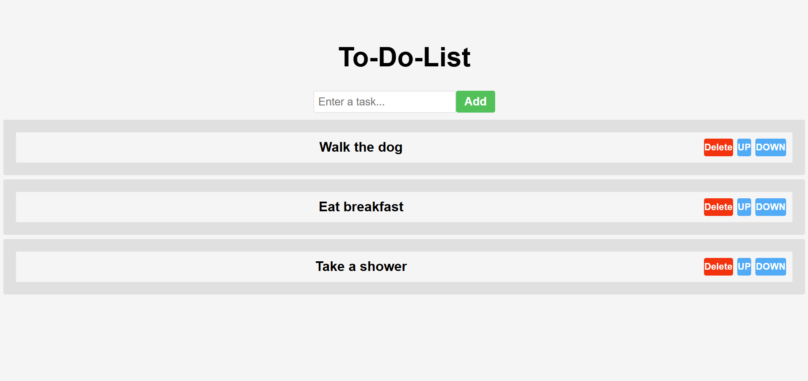

Una aplicación TO-DO desarrollada con React que permite añadir, eliminar y reordenar tareas fácilmente.

Durante el desarrollo de este proyecto aprendí a: 
  Utilizar React Hooks para manejar el estado y las actualizaciones del componente.
  Manipular listas dinámicas (añadir, eliminar y reordenar elementos).
  Trabajar con eventos y funciones puras en React.
  

