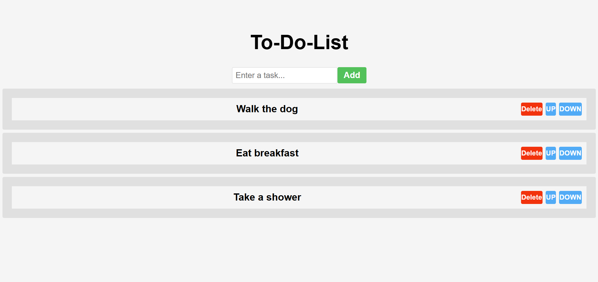

# ✅ To-Do App

Aplicación de gestión de tareas desarrollada con **React** que permite añadir, eliminar y reordenar tareas fácilmente.

<p align="center">
  
</p>

## ✨ Características

- ➕ Añadir nuevas tareas
- 🗑️ Eliminar tareas
- 🔀 Reordenar tareas
- ⚛️ Interfaz reactiva construida con componentes de React

## 🛠️ Tecnologías utilizadas

- **React**
- **JavaScript**
- **CSS**

## 🚀 Instalación y uso

Clona el repositorio e instala las dependencias:

```bash
git clone https://github.com/marcalvarez-dev/todo-app
cd todo-app
npm install
```

Ejecuta la aplicación en modo desarrollo:

```bash
npm run dev
```

## 📚 Qué aprendí con este proyecto

- Utilizar React Hooks para manejar el estado y las actualizaciones del componente
- Manipular listas dinámicas (añadir, eliminar y reordenar elementos)
- Trabajar con eventos y funciones puras en React
